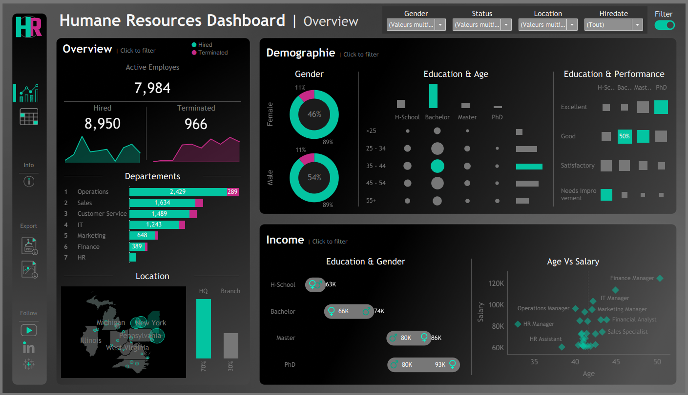
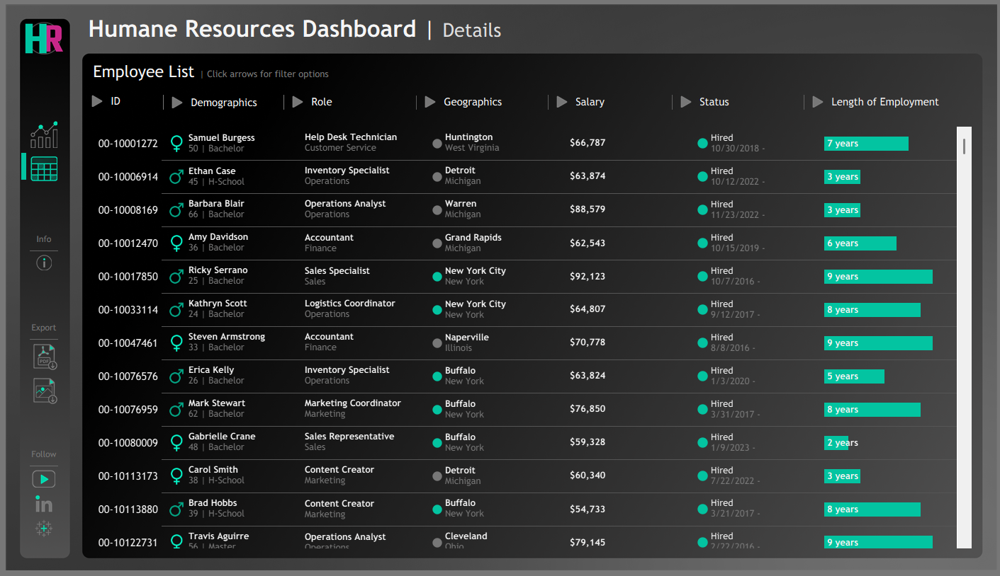

# Human Resources Analytics Dashboard (Tableau)

An interactive Tableau dashboard for HR analytics and workforce insights. This project was created using synthetic data and includes visualizations on employee demographics, attrition, performance, and more.

## 📊 Project Overview

This HR dashboard consists of:
- A **Summary View** for overall metrics (hires, terminations, department stats, location insights, gender distribution, performance vs education).
- A **Detail View** listing individual employee records with filtering options.

## 🚩 Problem

HR managers lacked a centralized view for key workforce KPIs and needed a tool to explore employee data visually and interactively.

## ✅ Solution

A dashboard was built using:
- **Synthetic HR data** generated with Python (Faker library).
- **Tableau Public** for visualization.
- **Custom icons and graphics** to enhance UX.

## 🌟 Results

- Consolidated HR data into a single interactive dashboard
- Enabled drill-down insights on department, salary, gender, etc.
- Improved HR decision-making through data exploration

## 🛠️ Technologies

- Tableau
- Python (Faker)
- Data Visualization

## 🔗 Live Dashboard

👉 [View on Tableau Public](https://public.tableau.com/app/profile/YOUR_USERNAME/viz/YOUR_DASHBOARD_NAME/HRSummary)

---

## 📸 Screenshots

| Summary View | Detailed View |
|--------------|----------------|
|  |  |

---

## 🙏 Inspiration

> 📌 This dashboard was built entirely by me as a learning project and portfolio piece.  
> It was inspired by the amazing work of [Baraa Salkini](https://www.datawithbaraa.com/tableau/tableau-hr-project-thank-you/) from his YouTube channel and Tableau Public dashboards.
